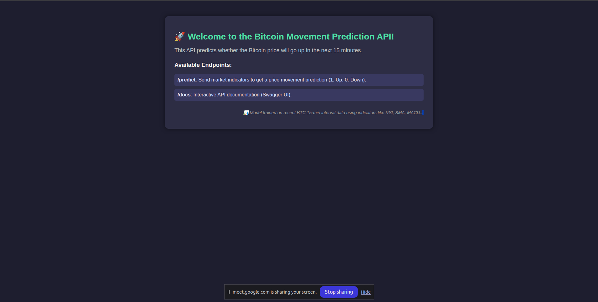
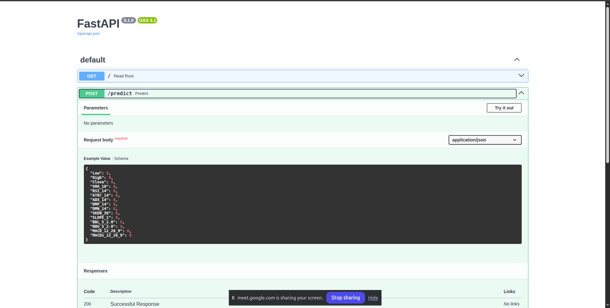
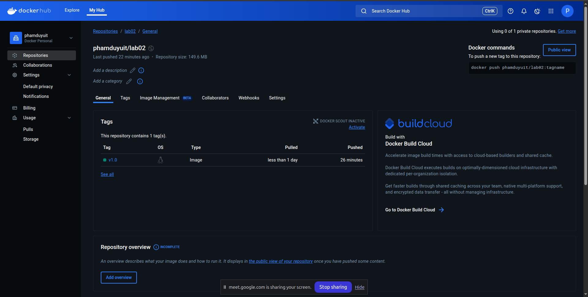

# Lab2: Serving model qua API và đóng gói với docker

# Thành viên: 
Hứa Tấn Sang \- 22521239 \\
Phạm Đình Anh Duy \- 22520337 \\
Nguyễn Đức Minh Mẫn \- 22520844 \\
Hoàng Minh Long \- 22520809 \\
## 1 Giới thiệu
Trong bài tập này nhóm đã đóng gói model ở lab 1 bằng Fast API và sau đó đưa vào docker.

## 2 Project structure
```bash
MLOps-Lab2/
│
├── backend/
│ ├── template/
│ │ ├── index.html
│ │── dockerfile
│ │── main.py
│ ├── requirements.txt│
├── docker-compose.yaml
├── README.md
```
## 3 Giới thiệu mô hình 
### 3.1 Dữ liệu 
- Dữ liệu về giá bitcoin được thu thập tại trang Binance.com thông qua API của sàn. 
- Được thu thập từ ngày 3/8/2024 - 8/4/2025 

### 3.2 Giới thiệu bài toán 
- Nhóm tập trung vào sử dụng mô hình Random Forest để dự đoán nên mua hay bán Bitcoin thông qua các chỉ báo kỹ thuật.  
	+ Bán được gán là nhãn 1: Khi giá phiên sau lớn hơn giá phiên trước. 
	+ Mua được gán nhãn 0: Khi giá phiên trước nhỏ hơn giá phiên sau.  
- Bộ dữ liệu có 6 cột. Bao gồm: Datetime, Open, High, Low, Close, Volume. 
- Các chỉ báo kỹ thuật bao gồm RSI, ATR, ADX, SMI, Skew, Slope, Bbands, MACD được tạo từ thư viện ta (pandas-ta)  

### 3.3 Mô hình 
- Mô hình được sử dụng là Random Forest nhằm dự đoán nên mua hay bán (cột Target có giá trị 0 (nên bán) hoặc 1 (nên mua). Cột Target được tính dựa trên hiệu số giá đóng cửa của phiên tiếp theo trừ phiên trước đó)

### 3.4 Metrics  
- Accuracy 
- Recall 
- Precision 
- F1 

## 4 Hướng dẫn thực hiện project

### B1: SSH vào server trường với user và địa chỉ  
```bash
ssh mlops@192.168.28.99
```

### B2: 
```bash
cd lab2/
```

### B3: 
```bash
docker compose up --build -d
```

### B4: Thực hiện ở terminal máy local
Map port 8000 của máy local tới server

```bash
ssh -L 8000:localhost:8000 -N mlops@192.168.28.99
```

### B5: Kết nối địa chỉ localhost:8000


### B6: Nếu muốn test: kết nối địa chỉ http://localhost:8000/docs


### Để có thể thực hiện lại bước trên máy cá nhân thì chỉ cần pull image trên dockerhub
```bash
docker run -it -d -p 8000:8000 --name c-lab02-1 phamduyuit/lab02:v1.0
```


## Video Demo
https://drive.google.com/drive/folders/1fbr8dYmfDR1zj6u92ThqAIdLyDPfqc5R
